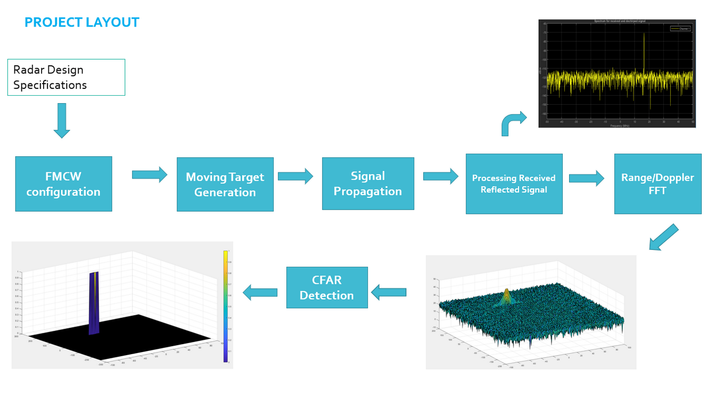

# SFND RADAR Target Generation and Detection

In this course we will discuss in detail what it takes for a radar to generate a perception for a self driving car. Starting from scratch we will build up from the basic principles of radar. We will cover the signal propagation and target response generation. Then we will deep dive into Range Doppler generation needed to localize the target real time.

We will write the code in MATLAB to generate the Target scenario, FMCW waveform creation and later using processing techniques like FFT, CFAR we will create the Range Doppler Maps (RDM). For the second part of the project we will work on the MATLAB-based Driving Scenario Simulator to deploy multi object tracking and clustering and study the results.

## Dependencies for Running Locally

To complete the project, you will need to download MATLAB on your computer, if you haven't already. To get started, you can follow these steps:

1. If you do not already have a MathWorks account, create one [here](https://www.mathworks.com/mwaccount/register). Be sure to verify your email (check your Junk/Spam folders) before moving on to step 2.
2. Download the installer [here](https://www.mathworks.com/licensecenter/classroom/udacity_sf_radar/).
3. Run the installer – it will guide you through the steps for your OS.

